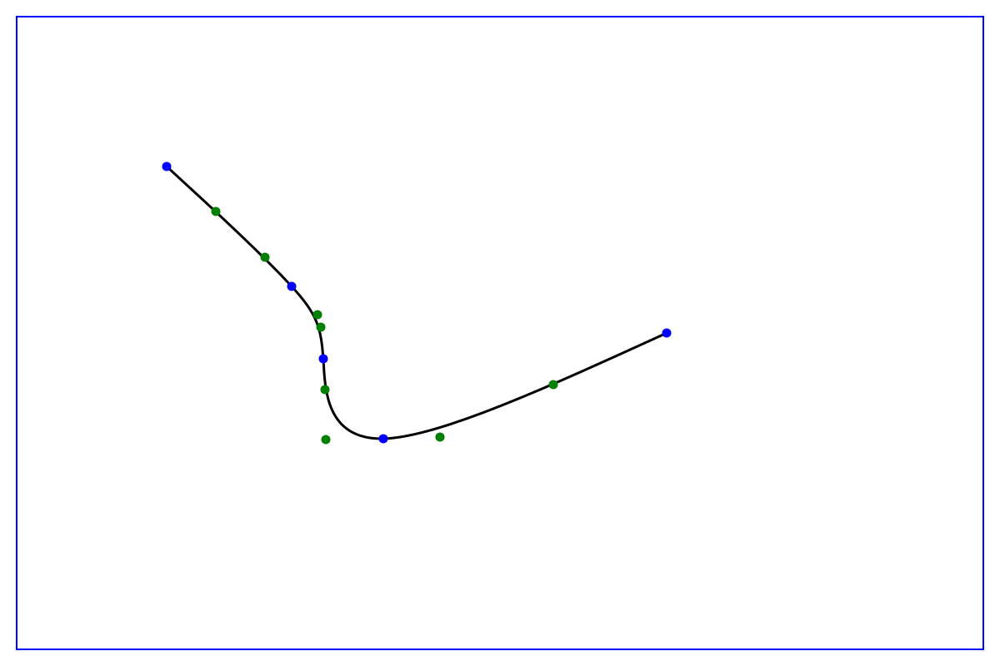

# B&eacute;zier interpolation

This module calculates a set of B&eacute;zier splines that represent a continuous curve
through a set of points.  Both integer and floating point versions are provided.
I use this to create curves in SVG files.

The algorithm was ported from the Javascript on
[this page](https://www.particleincell.com/wp-content/uploads/2012/06/bezier-spline.js).
The page describing what the code does is
[here](https://www.particleincell.com/2012/bezier-splines/).  This page also provides
a little interactive demo.

If you pass in N + 1 knots (points to be
interpolated), you will get N sets of control points back, one set for each part of
the curve.  Each set has four control points.  The first control point (P0) is the
starting knot, and the last control point (P3) is the ending knot.  P1 and P2 are
determined by the module.  A sample image is shown below, with the knots in blue and
the computed control points in green.

